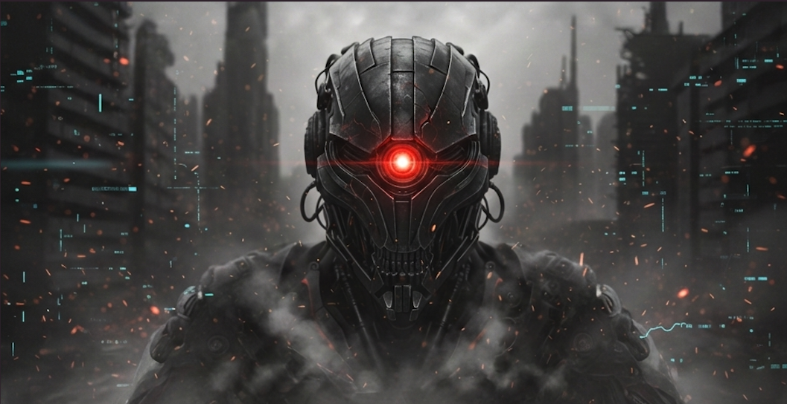

# R2 Project

#  Welcome to the R2 Project

**Next-Generation, Rust-Powered Red Team Infrastructure**

---

### ⚡ About
The **R2 Project** is dedicated to building modern, highly malleable, and cross-platform Command and Control (C2) frameworks for authorized Red Team operations and adversarial simulation with the power of AI assistance. 

---

### R2C2 Framework

👉 **[Explore the R2C2 Repository Here](https://github.com/R2-Project/R2C2)** 👈 

---

> ⚠️ **Disclaimer**
> All tools and code released under the R2 Project are strictly for **educational purposes and authorized security testing**. The developers assume no liability and are not responsible for any misuse or damage caused by this software.

